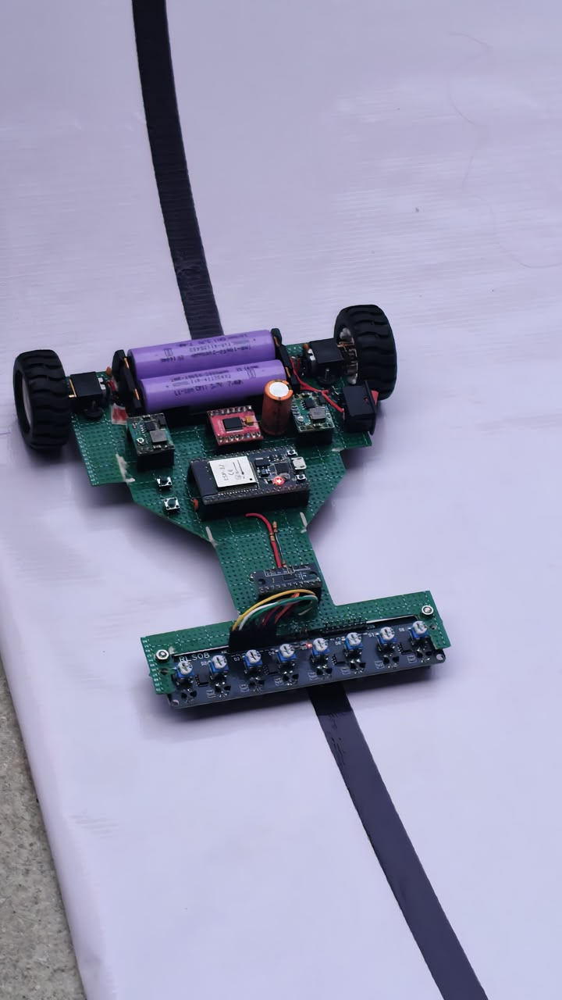
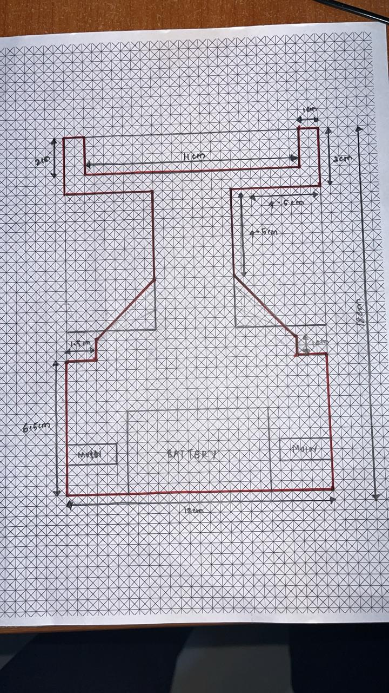
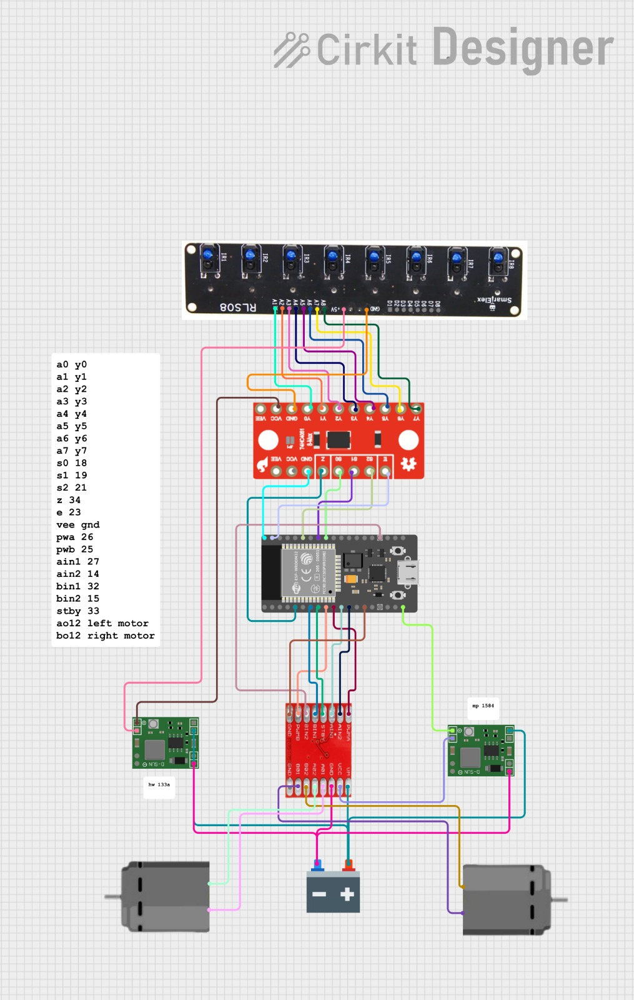

# 🚗 High-Speed PID Line Follower Robot

A high-speed line follower robot built using the ESP32 NodeMCU and an 8-array IR sensor. The robot uses a PID (Proportional-Integral-Derivative) control algorithm to achieve smooth and accurate line tracking.

---

## 📸 Project Images

| Robot | Chassis |
|--------|----------|
|  |  |

---

## ✨ Features

- PID-based line following
- High-speed operation
- ESP32-based controller
- Supports sharp turns
- Adjustable PID parameters
- Uses analog IR sensor readings

---

## 🛠 Components Used

| Component | Quantity |
|------------|-----------|
| ESP32 NodeMCU | 1 |
| TB6612FNG Motor Driver | 1 |
| N20 Motors | 2 |
| 8-Array IR Sensor | 1 |
| Smart ELX Multiplexer | 1 |
| 3.7V Li-ion Battery | 2 |
| Buck Converter | 2 |
| Chassis | 1 |

---

## ⚙ PID Parameters

```cpp
Kp = 65;
Ki = 0.003;
Kd = 18;
```

These values can be adjusted depending on the track.

---

## 🔌 Wiring Diagram



---

## 📂 Repository Structure

```
line_follower/
│
├── code.ino
├── README.md
├── wiring.jpeg
├── chasis.jpeg
├── pic1.jpeg
├── pic2.jpeg
└── components
```

---

## 🚀 Getting Started

### 1. Clone Repository

```bash
git clone https://github.com/yo5on/line_followER.git
```

### 2. Open in Arduino IDE

Open:

```
code.ino
```

### 3. Install Required Libraries

- ESP32 Board Package
- Wire Library

### 4. Upload the Code

1. Connect ESP32.
2. Select the correct COM port.
3. Upload the sketch.

---

## 🧠 Working Principle

1. IR sensors detect the position of the line.
2. The ESP32 calculates the error.
3. The PID controller generates correction values.
4. Motor speeds are adjusted accordingly.
5. The robot continuously follows the line.

---

## 📊 Formula

```
PID Output =
(Kp × Error) +
(Ki × Integral) +
(Kd × Derivative)
```

---

## 🔮 Future Improvements

- Auto PID tuning
- Maze solving algorithm
- Junction detection
- Bluetooth tuning interface
- OLED debugging display

---

## 👨‍💻 Author

**Yo5on**

Robotics and Embedded Systems Enthusiast

⭐ If you like this project, consider giving it a star!
